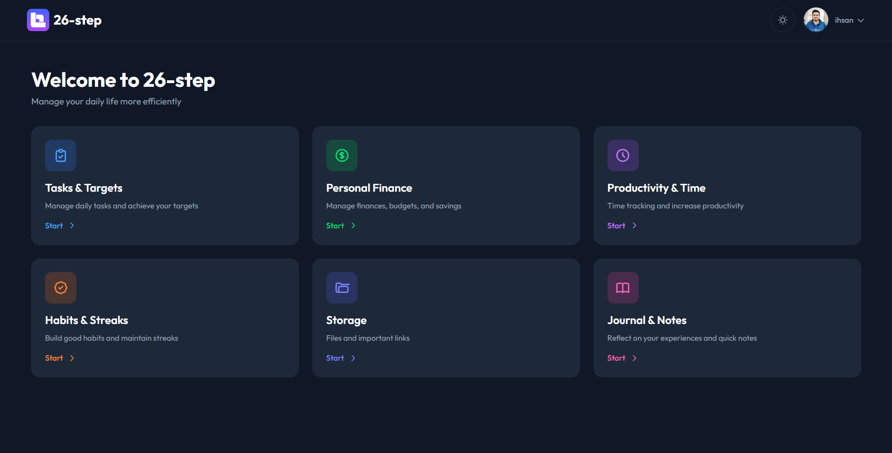

# Lifesync - Personal Life Management Platform

Platform web modern untuk mengelola berbagai aspek kehidupan sehari-hari dengan tujuan meningkatkan produktivitas, konsistensi, dan keseimbangan hidup.



## Tentang Aplikasi

Lifesync adalah aplikasi manajemen pribadi yang komprehensif yang membantu Anda mengatur tugas, keuangan, produktivitas, kebiasaan, penyimpanan, dan refleksi harian dalam satu platform terintegrasi.

## Fitur Utama

### 📋 Tasks & Targets
Manajemen tugas harian, mingguan, dan bulanan dengan tracking progres dan target yang jelas. Tetap terorganisir dan capai tujuan Anda dengan lebih efektif.

### 💰 Personal Finance
Tracking pemasukan, pengeluaran, anggaran, dan tabungan. Kelola keuangan pribadi Anda dengan lebih baik dan capai tujuan finansial.

### ⏱️ Productivity & Time
Timer Pomodoro, tracking waktu aktivitas, dan penjadwalan kegiatan. Tingkatkan produktivitas dan kelola waktu dengan lebih efisien.

### 🔥 Habits & Streaks
Tracking kebiasaan baik dengan sistem streak counter dan visualisasi progres. Bangun kebiasaan positif dan pertahankan konsistensi.

### 📁 Storage
Manajemen file, catatan, dan link penting. Simpan dan akses dokumen penting dengan mudah dan terorganisir.

### 📖 Journal & Notes
Refleksi harian dengan rich text editor, tracking mood, dan catatan cepat. Dokumentasikan pengalaman dan pemikiran Anda.

## Teknologi

- **Backend**: Laravel 12 (PHP 8.2+)
- **Frontend**: React + TypeScript + Vite
- **Database**: MySQL / SQLite
- **Authentication**: Laravel Sanctum
- **Styling**: Tailwind CSS

## Quick Start

### Backend
```bash
cd backend
composer install
cp .env.example .env
php artisan key:generate
php artisan migrate
php artisan serve
```

### Frontend
```bash
cd frontend
npm install
cp .env.example .env
npm run dev
```

## Struktur Proyek

```
Lifesync/
├── backend/              # Laravel API
│   ├── app/
│   ├── database/
│   └── routes/
├── frontend/             # React Frontend
│   ├── src/
│   │   ├── components/
│   │   ├── pages/
│   │   └── services/
│   └── package.json
└── README.md
```

## Fitur Unggulan

- ✨ **Dark Mode Support** - Tema gelap dan terang untuk kenyamanan mata
- 📱 **Responsive Design** - Akses optimal di desktop dan mobile
- 🔐 **Secure Authentication** - Sistem autentikasi yang aman
- 🎨 **Modern UI/UX** - Interface yang bersih dan intuitif
- ⚡ **Fast Performance** - Optimized untuk performa terbaik

## License

MIT

---

**Dibuat dengan ❤️ untuk membantu Anda mengelola kehidupan sehari-hari dengan lebih baik**
